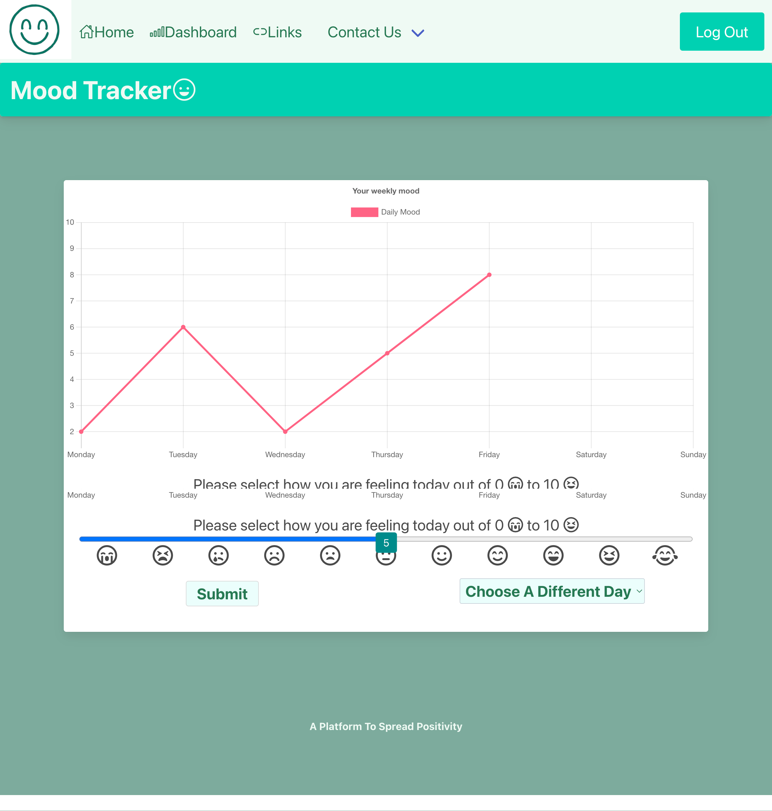
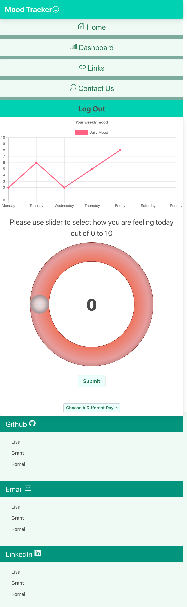

# Mood-Tracker

In this project we created a platform to track your own and friend's mental wellbeing. Our motivation behind this is to support people’s mental health through self help. Our initial plan for this application was to have a custom slider, where a user chooses their daily mood (from between 0 and 10) a graph of their moods throughout the week is generated. We achieved this goal and implemented additional features. The two main additional features we added is the ability to view other user's mood graphs and being able to put in a mood level for a past missed day. The problem that our application solves is it boosts positivity in the current circumstances of the world. Where people's mental health has been significantly affected. We have two main learning points that we have gained during this process. The first is that different CSS frameworks work better or worse with handlebars; and the second is that an application can work locally but won't necessarily work deployed.

## User Story

```md
AS a user 
I WANT to to be able to track mine and my friend's moods
S0 THAT I can be more aware of mine and their's current mental health
```

## Technology Used

### Technologies
- CSS
- HTML
- JSON
- Round slider jQuery plugin
  
### JavaScript Libraries
- Node.js
- Express.js
- Day.js
- jQuery
- Handlebars.js
- Chart.js
  
### Node Packages
- MYSQL2 
- Sequelize 
- Dotenv 
- Nodemon 
- Bcrypt 
- Express-handlebars 
- Express-session 
  
### CSS Framework
- Bulma
  
### Language
- JavaScript
  
### Icon Libraries
- Font Awesome 5
- Ionicons

## Obstacles

- One of our obstacles was when working separately, we would have merging conflicts, we improved on this by communicating effectively to what we were currently working on.
- A second issue we had is that within the CSS framework we used (Bulma) it only had specific responsive sections, we fixed this through using media queries where necessary.
- Another challenge that occurred was that although the application was working locally it sometimes wouldn’t work deployed on heroku. This challenge seems somewhat unavoidable in creating an application however we did deploy it more frequently to get ahead of the problem.
- The last challenge we had was in regards to node packages, in this case trying to use Bulma sliders, the custom styling of the slider wasn’t co-operating. This meant we had to be adaptive and do it using custom CSS and JavaScript. 


## Future Developments

- The first future development we would like to add to this application is email verification.  Where an email is sent to the user to confirm they want to join the site.
- The second expansion is to increase privacy for the user, through being able to make their account private and select which friends to share their information with.
- The next advancement would be having the user be able to see their past weekly mood graphs. We would want them to be able to see them in order to look back and reflect on their emotional growth.
- Another expansion we want to apply to our website is for the user to see their overall weekly and monthly moods, to be able to track your improvement over larger time frames.
- The final improvement is for the user to be able to leave positive comments on their friend’s charts to make the application more interactive.


## Application Screenshots

### Desktop Interface 1024px and above


### Tablet Interface 769px to 1023px


### Phone interface under 768px 



## Deployed link:

Heorku: https://mood-tracker-gkl.herokuapp.com/

GitHub repo: https://github.com/GrantRT/MoodTracker.git


## The Project Team :

- [Lisa](https://github.com/LisaCR01)
- [Grant](https://github.com/GrantRT)
- [Komal](https://github.com/KJ234)
